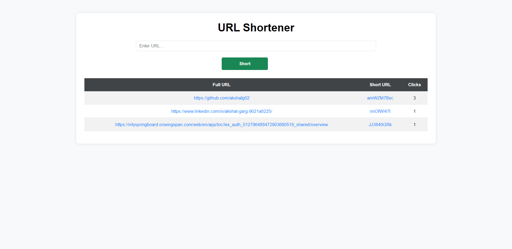

# URLshortener ✂️
A simple URL shortener app that can shorten any large url


## Author 🧔‍♂️

- [@akshat](https://www.github.com/akshatg02/)

## Deployment 🚀

To deploy this project run

```bash
  node .\server.js
```


## Demo 

[@URLshortener](https://urlshortener-6656.onrender.com/)


## Features ⚙️

- Simple UI
- NoSQL Database

## About Me 🧔‍♂️
I'm a Full stack Developer.

## 🔗 Links
[](https://www.linkedin.com/in/akshat-garg-9021a8225/)


## 🛠 Skills
HTML, CSS, JavaScript, MongoDB NodeJs, ExpressJs, EJS, etc.


## Tech Stack 🔥

**Client:** HTML, CSS, JavaScript

**Server:** NodeJs, ExpressJs

**Database:** MongoDB


## Screenshots 📷


